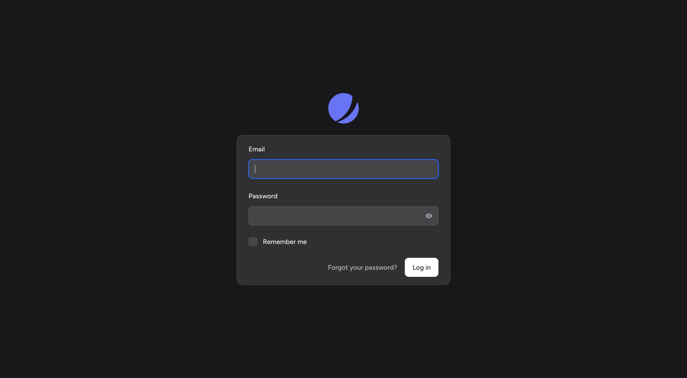

# Jetstream Flux

[](https://packagist.org/packages/grpaiva/jetstream-flux)
[](https://packagist.org/packages/grpaiva/jetstream-flux)

Jetstream Flux is a Laravel package that seamlessly integrates [FluxUI](https://fluxui.dev) components into your Jetstream with Livewire starter kit views. Built to simplify and speed up Laravel applications creation, Jetstream Flux replaces Jetstream's default views with beautifully styled, consistent, and flexible FluxUI components.

This package is designed to provide developers with a Flux-powered interface, allowing them to spin up new Laravel applications with clean, concise, and reusable UI components from Flux. 

**Note:** To use this package, you will need a Flux license.

## Features

- Publish Jetstream views styled with FluxUI components
- Provides a consistent design language throughout your Laravel app
- Easily customizable with both simple and composable components from Flux
- Includes all necessary views for authentication, profile management, teams, and more
- Options to publish the views under `resources/views/vendor` or replace Jetstream views directly in `resources/views`

## Requirements

This package requires the following:

```json
{
    "php": "^8.2",
    "laravel/framework": "^11.0",
    "laravel/jetstream": "^5.2",
    "livewire/livewire": "^3.0",
    "flux/flux": "^1.0",
    "flux/flux-pro": "^1.0"
}
```

You'll need to have a Flux license to use this package.

## Installation

First, require the package using Composer:

```bash
composer require grpaiva/jetstream-flux
```

After installing the package, you'll need to publish the views. You can either publish them into the `resources/views/vendor/jetstream-flux` directory (default) or replace the existing Jetstream views.

## Publish Views

**Option 1: Default Mode (Vendor)**

This command will publish the FluxUI-based Jetstream views under `resources/views/vendor/jetstream-flux`:

```bash
php artisan jetstream-flux:publish --mode=vendor
```

**Option 2: Replace Mode (Overwrite Existing Views)**
This command will replace the existing Jetstream views directly in the `resources/views` directory:

```bash
php artisan jetstream-flux:publish --mode=replace
```

## Available Views

The package publishes the following views, which are fully integrated with FluxUI components:

- `dashboard.blade.php`  
- `navigation-menu.blade.php`


- **./api:**
    - `api-token-manager.blade.php`
    - `index.blade.php`


- **./auth:**
    - `confirm-password.blade.php`
    - `forgot-password.blade.php`
    - `login.blade.php`
    - `register.blade.php`
    - `reset-password.blade.php`
    - `two-factor-challenge.blade.php`
    - `verify-email.blade.php`


- **./components:**
    - `action-message.blade.php`
    - `action-section.blade.php`
    - `application-logo.blade.php`
    - `application-mark.blade.php`
    - `authentication-card-logo.blade.php`
    - `authentication-card.blade.php`
    - `banner.blade.php`
    - `confirms-password.blade.php`
    - `dropdown-link.blade.php`
    - `form-section.blade.php`
    - `section-border.blade.php`
    - `section-title.blade.php`
    - `switchable-team.blade.php`
    - `validation-errors.blade.php`
    - `welcome.blade.php`


- **./layouts:**
    - `app.blade.php`
    - `guest.blade.php`


- **./profile:**
    - `delete-user-form.blade.php`
    - `logout-other-browser-sessions-form.blade.php`
    - `show.blade.php`
    - `two-factor-authentication-form.blade.php`
    - `update-password-form.blade.php`
    - `update-profile-information-form.blade.php`


- **./teams:**
    - `create-team-form.blade.php`
    - `create.blade.php`
    - `delete-team-form.blade.php`
    - `show.blade.php`
    - `team-member-manager.blade.php`
    - `update-team-name-form.blade.php`


## About FluxUI

FluxUI is a comprehensive set of UI components created by [Caleb Porzio](https://x.com/calebporzio) and [Hugo Sainte-Marie](https://x.com/ashugeo). It's built with simplicity, composability, and consistency in mind, allowing developers to easily create elegant and functional UI components. The principles of FluxUI include simplicity, composability, friendliness, and brevity, all aimed at improving the app-building experience.

To learn more about FluxUI, check out [FluxUI’s documentation](https://fluxui.dev/docs).

## Screenshots
The idea is indeed to look almost exactly like the default Jetstream views, but using FluxUI components.

### Login Page


### Registration Page


### Profile Settings


### Team Settings


## Contributing

Feel free to contribute to the project by submitting issues or pull requests.


*This package is open-sourced software licensed under the MIT license.*